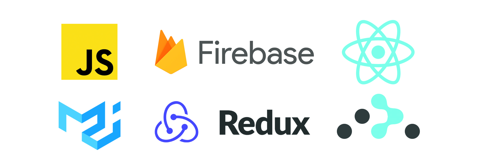

<h1 align="center">
  Simplified Google Keep clone built with React and Firebase
</h1>

<h3 align="center">
  Web app based on <a href="https://keep.google.com/">Google Keep</a>  
  <a href="https://glaz-notes-269221.web.app/">Visit the live app</a>
</h3>

<h2 align="center">Little preview</h2>

  </img>

## Account for testing

If you don't want to create an account you can log in using these credentials

- email: testx@email.com
- pass: test1234

## Explanation

It's just a showcase app, based on Google Keep. It is made only for practice purposes. I implemented only most important features.

## How to run it locally?

- To run it locally you can run this script in command line  
  `npm start`  
- Make sure you have all dependencies installed, if not then run  
  `npm install`

## License

[MIT](https://opensource.org/licenses/MIT)
